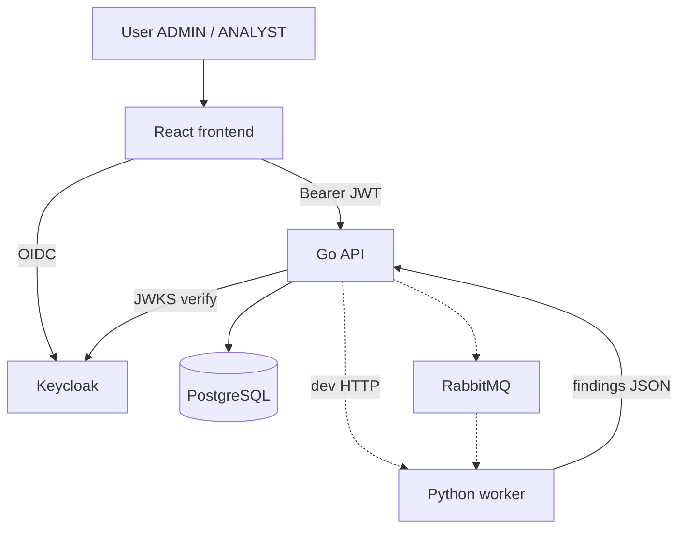

# CyberWatch Development Plan

## Goal

Build a small but realistic cybersecurity monitoring platform.

**Priorities:** functional app · clean architecture · security · demo quality

---

## Progress

| Phase | Topic | Status |
|-------|-------|--------|
| 1 | Frontend (React) | **Done** |
| 2 | Go API + PostgreSQL | **Done** |
| 3 | Keycloak IAM | **Done** |
| 4 | Python scanner worker | **Done** |
| 5 | RabbitMQ | Next |
| 6 | Redis | Planned |
| 7 | Elasticsearch | Planned |
| 8 | Docker Compose | Planned |
| 9 | Demo preparation | Planned |

---

## System relations



| Relation | Status |
|----------|--------|
| User → React → Keycloak → API → PostgreSQL | **Done** |
| Python worker `POST /scan` (standalone) | **Done** |
| API → RabbitMQ → Worker | Planned |

Public overview: [`README.md`](README.md)

---

## Phase 1 — Frontend ✅

`frontend/` — React · TypeScript · Vite · Chakra · TanStack Query · Axios · Recharts · oidc-client-ts

**Done:** Dashboard · Companies · Scan details · Keycloak OIDC · AlgoSecure UI + light/dark mode

See [`frontend/README.md`](frontend/README.md).

---

## Phase 2 — Go API + PostgreSQL ✅

`backend-api/` — Go · Gin · GORM · PostgreSQL

**Done:** Company → Scan → Vulnerability · JWT-ready routes · env config

See [`backend-api/README.md`](backend-api/README.md).

---

## Phase 3 — Keycloak ✅

Hosted Cloud-IAM · clients `cyberwatch-frontend` / `cyberwatch-api` · roles `ADMIN` / `ANALYST`

Guide: [`docs/KEYCLOAK.md`](docs/KEYCLOAK.md)

---

## Phase 4 — Python scanner ✅

`worker/` — FastAPI standalone (no RabbitMQ yet).

**Pipeline:** validate → DNS → HTTP → headers → technologies → ports → risk → JSON

**Run:**

```powershell
cd worker
python -m venv .venv
.\.venv\Scripts\Activate.ps1
pip install -r requirements.txt
uvicorn app.main:app --reload --port 8001
```

`POST /scan` with `{ "domain": "example.com" }`

Business logic is in `ScanService` — queue transport can wrap it later.

See [`worker/README.md`](worker/README.md).

---

## Phase 5 — RabbitMQ (next)

- Queue `scan_jobs`
- API publishes on scan create
- Worker consumes and returns / persists findings
- Replace temporary direct HTTP call

---

## Phase 6 — Redis

Cache dashboard stats and scan status.

---

## Phase 7 — Elasticsearch

Worker logs and scan events.

---

## Phase 8 — Docker

Compose: frontend · api · worker · postgres · rabbitmq · redis · elasticsearch  
Keycloak stays on Cloud-IAM unless moved later.

---

## Phase 9 — Demo

1. Login (Keycloak)
2. Add company (`ADMIN`)
3. Start scan
4. Worker executes (HTTP now / RabbitMQ next)
5. Results on dashboard

> I built a simplified External Attack Surface Monitoring platform using a distributed architecture close to real cybersecurity products.

---

## Security rules

- No secrets in code
- Env vars only
- JWT + roles on API
- Keycloak owns passwords
- Worker: passive checks only, short timeouts, fixed port list
