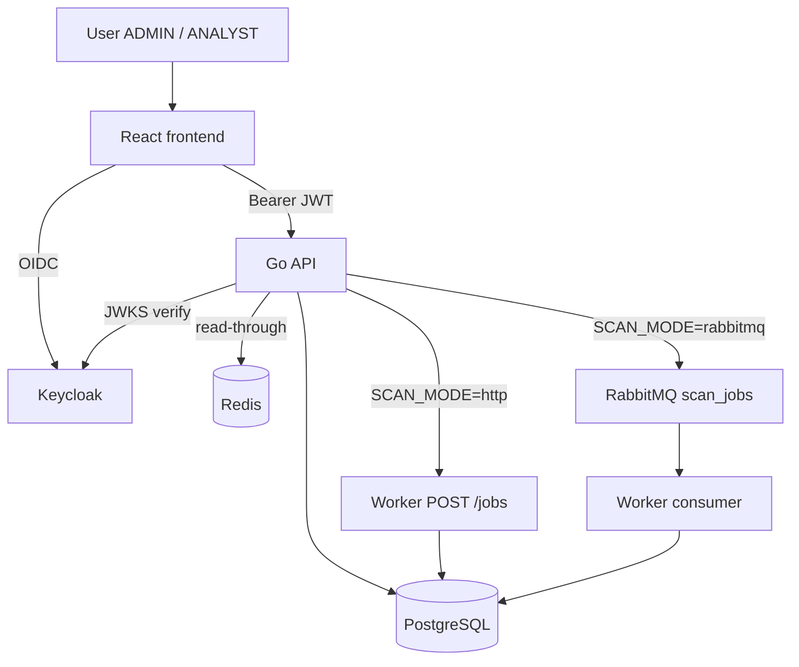

# CyberWatch Development Plan

## Goal

Build a small but realistic cybersecurity monitoring platform.

**Priorities:** functional app · clean architecture · security · demo quality

---

## Progress

| Phase | Topic | Status |
|-------|-------|--------|
| 1 | Frontend (React) | **Done** |
| 2 | Go API + PostgreSQL | **Done** |
| 3 | Keycloak IAM | **Done** |
| 4 | Python scanner worker | **Done** |
| 5 | RabbitMQ async pipeline | **Done** |
| 6 | Redis | **Done** |
| 7 | Elasticsearch | Planned |
| 8 | Docker Compose | Planned |
| 9 | Demo preparation | Planned |

---

## System relations



| Relation | Status |
|----------|--------|
| User → React → Keycloak → API → PostgreSQL | **Done** |
| Python `ScanService` + `POST /scan` | **Done** |
| Dual transport HTTP `/jobs` + RabbitMQ | **Done** |
| Redis read-through cache | **Done** |

---

## Phase 1–5 ✅

See package READMEs and earlier git history.

- Frontend: [`frontend/README.md`](frontend/README.md)
- API: [`backend-api/README.md`](backend-api/README.md)
- Keycloak: [`docs/KEYCLOAK.md`](docs/KEYCLOAK.md)
- Worker: [`worker/README.md`](worker/README.md)

---

## Phase 6 — Redis caching ✅

**Goal:** speed up reads without changing business logic. PostgreSQL remains source of truth.

| Env | Example |
|-----|---------|
| `REDIS_URL` | `redis://localhost:6379` (optional — API works without Redis) |

| Key | TTL | Used for |
|-----|-----|----------|
| `dashboard:stats` | 60s | Dashboard aggregates |
| `companies:list` | 5m | Company list |
| `company:{id}` | 5m | Company by id |
| `scan:{id}` | 30s | Scan details / summary |
| `scan:status:{id}` | 10s | Scan status |

**Strategy:** read-through (Redis → on miss → PostgreSQL → store).

**Invalidation:** company create/update/delete · scan create · scan failed (publish) · dashboard when a completed/failed scan is observed from DB.

**Resilience:** if Redis is unset or down, requests continue via PostgreSQL. Logs: hit / miss / invalidate / reconnect.

**Code:** `backend-api/internal/cache/` (`interfaces.go`, `cache.go`, `redis.go`) · services depend on `cache.Cache`.

```powershell
docker run -d --name cyberwatch-redis -p 6379:6379 redis:7-alpine
# backend-api/.env → REDIS_URL=redis://localhost:6379
```

---

## Phase 7–9

Elasticsearch · Docker Compose · Demo prep — planned.

---

## Security rules

- No secrets in code · env vars only
- JWT + roles on API · Keycloak owns passwords
- Worker: passive checks only · durable queue messages · DLQ on final failure
- Cache never overrides auth or validation
