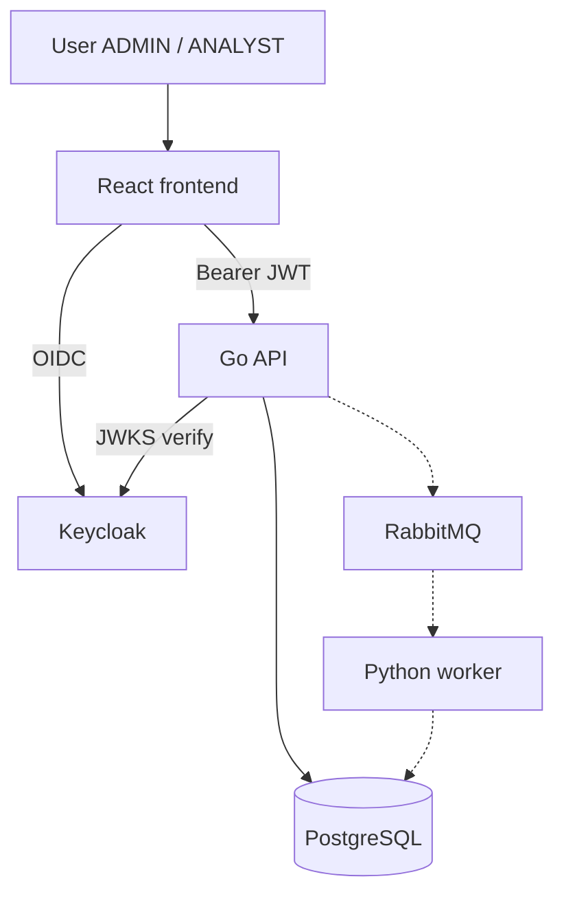

# CyberWatch Development Plan

## Goal

Build a small but realistic cybersecurity monitoring platform.

**Priorities:** functional app · clean architecture · security · demo quality

---

## Progress

| Phase | Topic | Status |
|-------|-------|--------|
| 1 | Frontend (React) | **Done** |
| 2 | Go API + PostgreSQL | **Done** |
| 3 | Keycloak IAM | **Done** |
| 4 | Python scanner worker | Next |
| 5 | RabbitMQ | Planned |
| 6 | Redis | Planned |
| 7 | Elasticsearch | Planned |
| 8 | Docker Compose | Planned |
| 9 | Demo preparation | Planned |

---

## System relations (target)

Matches the app today; dashed edges are not implemented yet.

| Relation | Status |
|----------|--------|
| User → React → Keycloak → API → PostgreSQL | **Done** |
| API → RabbitMQ → Worker → DB | Planned |

Public overview: [`README.md`](README.md)

---

## Phase 1 — Frontend ✅

`frontend/` — React · TypeScript · Vite · Chakra · TanStack Query · Axios · Recharts · oidc-client-ts

**Done:**

- Dashboard, Companies, Scan details
- Keycloak login (no local login page)
- Protected routes + Bearer token on API calls
- AlgoSecure-inspired UI (green `#80B942`, navy) + light/dark mode

See [`frontend/README.md`](frontend/README.md).

---

## Phase 2 — Go API + PostgreSQL ✅

`backend-api/` — Go · Gin · GORM · PostgreSQL

**Done:**

- Layers: handlers → services → repositories → models
- `Company` → `Scan` → `Vulnerability`
- Routes: health, dashboard, companies CRUD, scans
- Env-based config

See [`backend-api/README.md`](backend-api/README.md).

---

## Phase 3 — Keycloak ✅

Hosted via Cloud-IAM.

| Item | Value |
|------|-------|
| Frontend client | `cyberwatch-frontend` (public, PKCE) |
| API client | `cyberwatch-api` (JWKS validation) |
| Roles | `ADMIN`, `ANALYST` |

**Flow:** React → Keycloak → `/auth/callback` → Bearer token → Go API JWT + RBAC

Guide: [`docs/KEYCLOAK.md`](docs/KEYCLOAK.md)

---

## Phase 4 — Python scanner (next)

`worker/` modules: `dns.py` · `http.py` · `technology.py` · `risk.py`

Scans stay `PENDING` until this phase runs real checks.

---

## Phase 5 — RabbitMQ

- Queue `scan_jobs`
- API publishes on scan create
- Worker consumes and writes results to PostgreSQL

---

## Phase 6 — Redis

Cache dashboard stats and scan status.

---

## Phase 7 — Elasticsearch

Worker logs and scan events.

---

## Phase 8 — Docker

Compose: frontend · api · worker · postgres · rabbitmq · redis · elasticsearch  
Keycloak stays on Cloud-IAM unless moved later.

---

## Phase 9 — Demo

1. Login (Keycloak)
2. Add company (`ADMIN`)
3. Start scan
4. Worker runs (after phases 4–5)
5. Results on dashboard

> I built a simplified External Attack Surface Monitoring platform using a distributed architecture close to real cybersecurity products.

---

## Security rules

- No secrets in code
- Env vars only
- JWT + roles on API
- Keycloak owns passwords
