# CyberWatch

## External Attack Surface Monitoring Platform


CyberWatch is a simplified **External Attack Surface Monitoring** platform.

It lets security analysts:

- manage monitored companies
- launch passive external scans
- detect publicly exposed weaknesses
- compute a risk score
- review results on a dashboard

---

## Demo video

▶ <a href="https://youtu.be/kTdNA7i3-G4" target="_blank" rel="noopener noreferrer">Watch the demo on YouTube</a>

---

## Project article

📝 <a href="https://yaakoub-chaker-bteit.web.app/news/cyberwatch-external-attack-surface-monitoring-platform-7eTnGIdh2vOV2gayBxIM" target="_blank" rel="noopener noreferrer">CyberWatch — External Attack Surface Monitoring Platform</a>

Full write-up on my portfolio: architecture, stack, and what the platform does.

---

## Screenshots

### Operations dashboard — overview & charts

Home view with company / critical stats, risk evolution, and vulnerability distribution.

<p align="center">

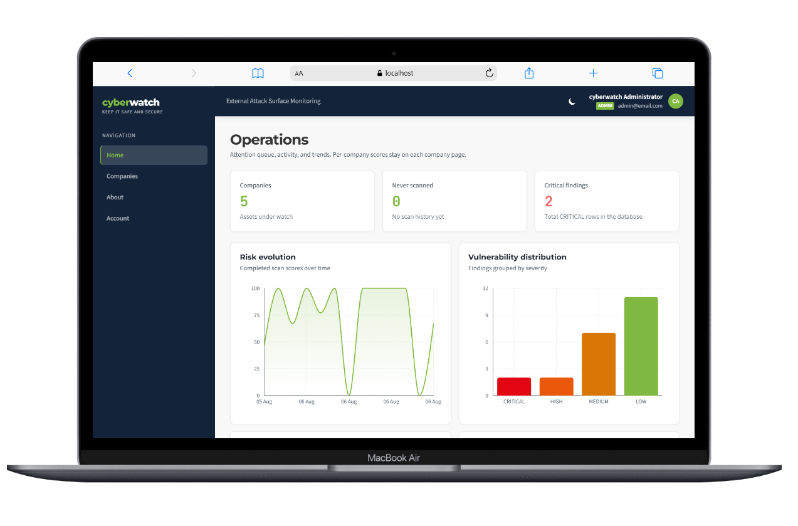

</p>

### Security score & findings by severity

Average security score, findings donut with total count, and the needs-attention list.

<p align="center">

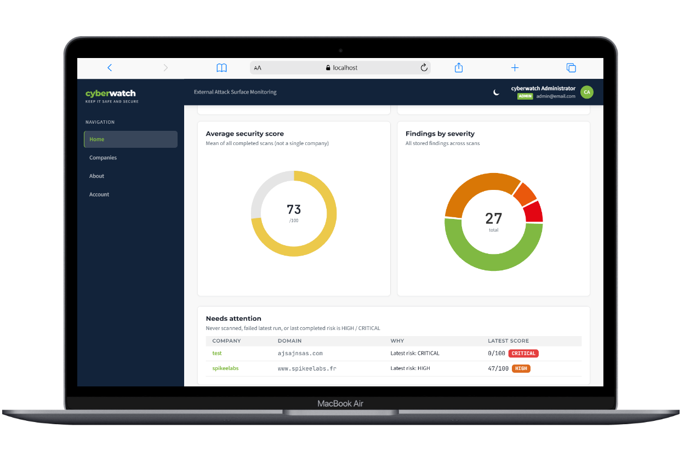

</p>

### Needs attention & recent activity

Priority queue for HIGH / CRITICAL assets and the latest scan runs.

<p align="center">

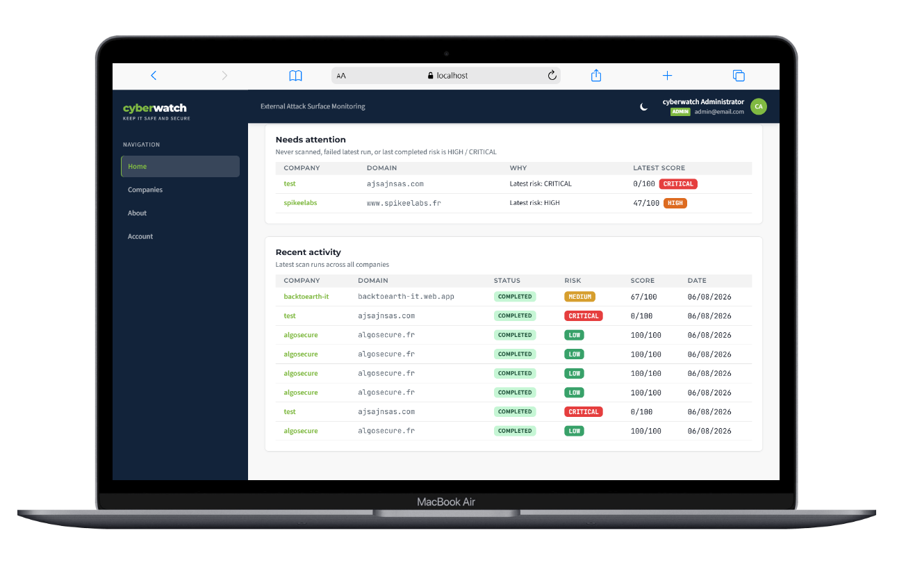

</p>

### Scan analysis — findings detail

Per-scan score, status, and vulnerability findings for a company domain.

<p align="center">

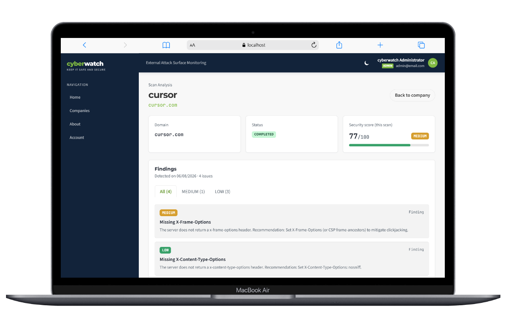

</p>

### Companies — manage assets & live scans

Company table with latest scores, actions, and scans currently in progress.

<p align="center">

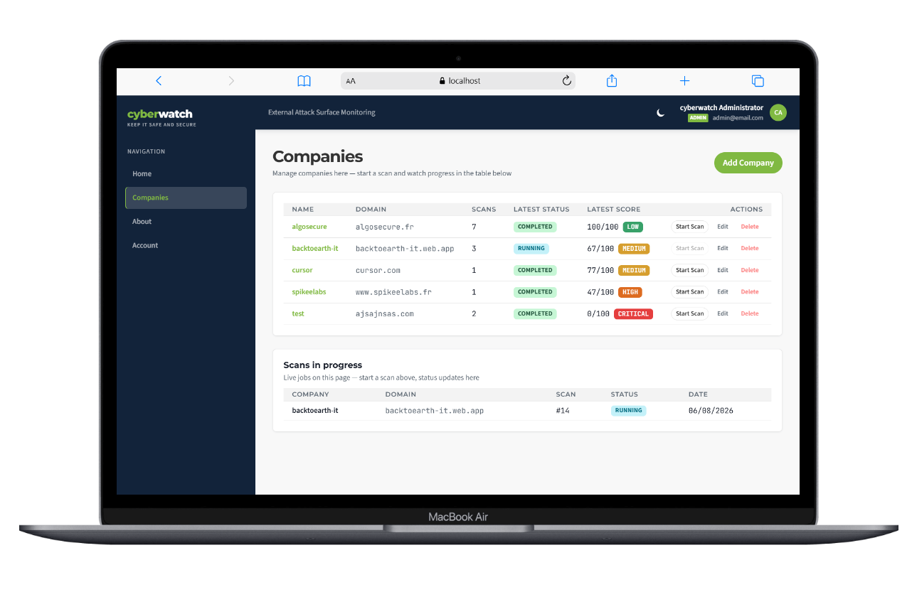

</p>

### About — what CyberWatch checks

Product overview: DNS, HTTP, headers, technologies, ports, and risk scoring.

<p align="center">

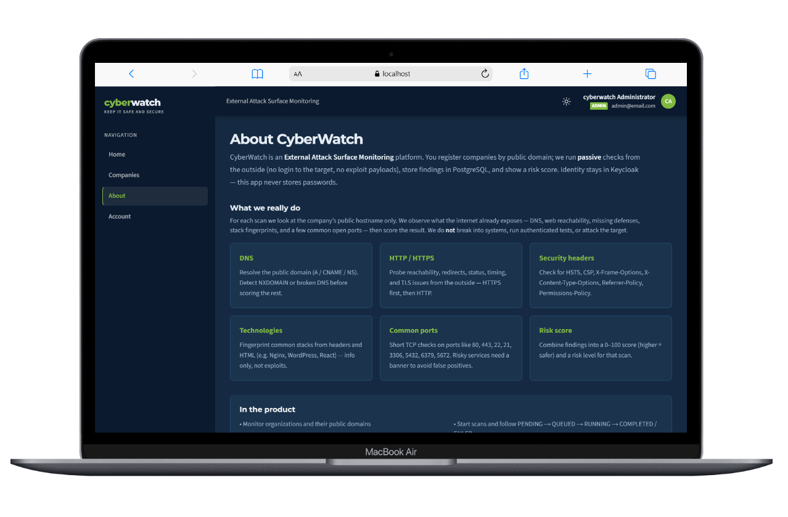

</p>

### Mobile — operations overview

Responsive home view: critical findings and risk trends on phone.

<p align="center">

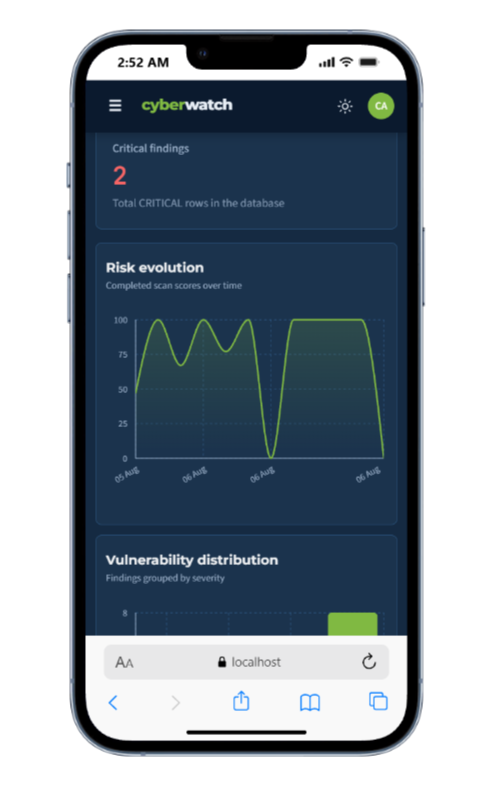

</p>

### Mobile — charts

Risk evolution and vulnerability distribution on a small screen.

<p align="center">

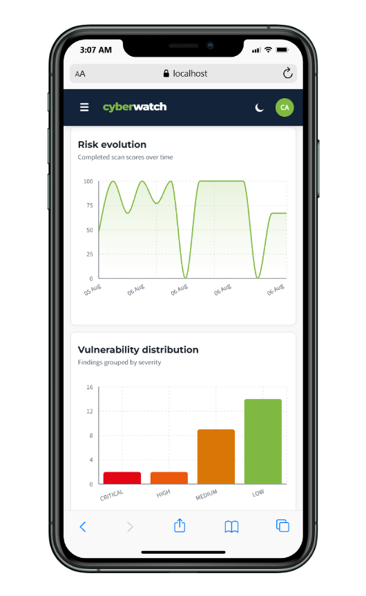

</p>

---

## Status

<div align="center">

| Component | Status |
|-----------|--------|
| React frontend | **Done** |
| Go REST API + PostgreSQL | **Done** |
| Keycloak (Cloud-IAM, external) | **Done** |
| Python scanner worker | **Done** |
| RabbitMQ dual scan transport | **Done** |
| Docker Compose | **Done** |
| Redis | [Planned](docs/PLANNED.md) |
| Elasticsearch | [Planned](docs/PLANNED.md) |
| CI/CD (GitHub Actions) | [Planned](docs/PLANNED.md) |

</div>

---

## Architecture (current)

This is what runs **today**. Redis and Elasticsearch are **not** part of the stack.

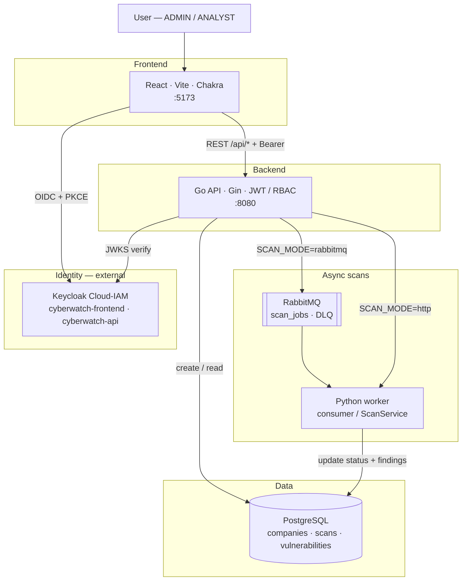

<div align="center">

| Who | PostgreSQL role |
|-----|-----------------|
| **Go API** | Creates companies & scans · serves dashboard / lists / details |
| **Python worker** | Updates scan status · writes vulnerabilities + risk score |

</div>

Same database — different operations.

### Docker Compose services

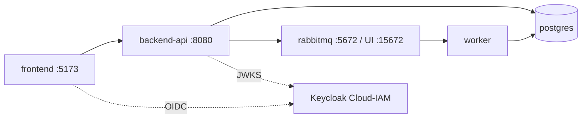

<div align="center">

| Service | Role | Port |
|---------|------|------|
| `frontend` | React UI (static build) | 5173 |
| `backend-api` | Go REST API | 8080 |
| `worker` | Python scanner (`python -m app.consumer` by default) | 8001\* |
| `postgres` | Primary database | 5432 |
| `rabbitmq` | Job queue + management UI | 5672 · 15672 |

</div>

\* Port `8001` is used when `SCAN_MODE=http` (uvicorn). With the default RabbitMQ consumer it is mapped but idle.

**Not in Compose:** Redis · Elasticsearch · Keycloak (stays on Cloud-IAM).

Network: `cyberwatch-network` · Volumes: `postgres_data`, `rabbitmq_data`

---

## How it works

### Authentication

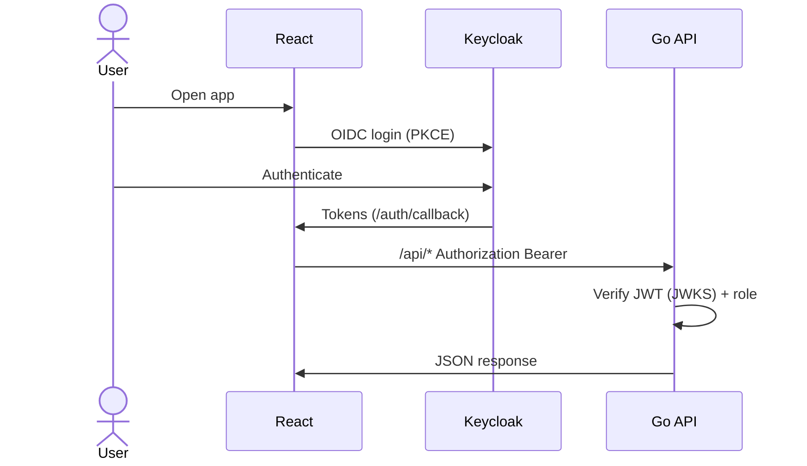

<div align="center">

| Role | Permissions |
|------|-------------|
| `ADMIN` | Companies CRUD · create scans · view all |
| `ANALYST` | View dashboard / companies / scans · create scans |

</div>

Setup guide: [`docs/KEYCLOAK.md`](docs/KEYCLOAK.md)

### Scan pipeline

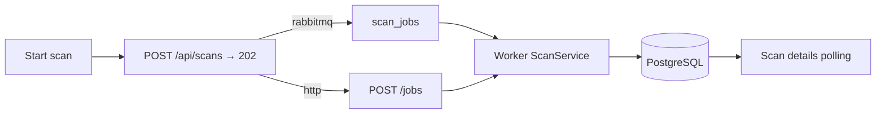

Statuses: `PENDING` → `QUEUED` → `RUNNING` → `COMPLETED` / `FAILED`

<div align="center">

| `SCAN_MODE` | Behavior |
|-------------|----------|
| `rabbitmq` (Compose default) | API publishes to RabbitMQ · worker runs `python -m app.consumer` |
| `http` | API calls `WORKER_URL/jobs` · worker must run uvicorn |

</div>

### API surface

<div align="center">

| Method | Path | Auth |
|--------|------|------|
| `GET` | `/health` | Public |
| `GET` | `/api/dashboard` | JWT |
| `GET/POST` | `/api/companies` | JWT · write = ADMIN |
| `GET/PUT/DELETE` | `/api/companies/:id` | JWT · write = ADMIN |
| `GET/POST` | `/api/scans` | JWT · create = ADMIN or ANALYST |
| `GET` | `/api/scans/:id` | JWT |

</div>

### Data model

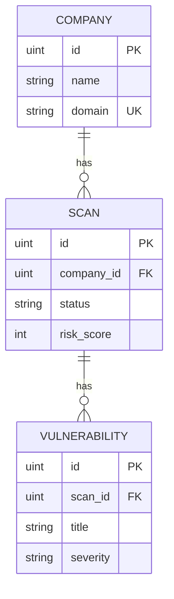

Worker scanners (passive): DNS · HTTP · security headers · technologies · common ports · risk score.

---

## Project structure

```text
CyberWatch/
├── frontend/           # React + OIDC (Dockerfile)
├── backend-api/        # Go REST API (Dockerfile)
├── worker/             # Python scanner (Dockerfile)
├── infrastructure/     # docker-compose.yml + shared .env
├── docs/
│   ├── KEYCLOAK.md     # Cloud-IAM setup
│   └── PLANNED.md      # Future: Redis · Elasticsearch · CI
├── Makefile            # make start | stop | logs | status
└── README.md
```

Package details: [`frontend/README.md`](frontend/README.md) · [`backend-api/README.md`](backend-api/README.md) · [`worker/README.md`](worker/README.md)

---

## Quick start

**Prerequisites:** [Docker Desktop](https://docs.docker.com/desktop/) (Compose v2) · Make (`winget install ezwinports.make`) · Keycloak Cloud-IAM ([guide](docs/KEYCLOAK.md))

**1. Env** — one file for the whole platform: `infrastructure/.env`  
(create once from `.env.example` only if missing)

**2. Start**

```powershell
make start
```

**3. Open**

<div align="center">

| URL | Service |
|-----|---------|
| http://localhost:5173 | Frontend |
| http://localhost:8080/health | API health |
| http://localhost:15672 | RabbitMQ UI |

</div>

**4. Stop / inspect**

```powershell
make stop
make logs      # follow logs
make status    # container status
```

Volumes keep data after `make stop`. Wipe with:

```powershell
docker compose --project-directory infrastructure -f infrastructure/docker-compose.yml down -v
```

### Local run (without Docker)

Same `infrastructure/.env`. Start PostgreSQL yourself, then:

```powershell
cd backend-api
go run ./cmd/server

cd frontend
npm install
npm run dev

cd worker
# SCAN_MODE=http → uvicorn app.main:app --port 8001
# SCAN_MODE=rabbitmq → python -m app.consumer
```

---

## Planned (not implemented)

Redis (cache), Elasticsearch (scan events / search), and GitHub Actions (CI/CD) are **intentionally postponed**.

Target future architecture and notes: **[`docs/PLANNED.md`](docs/PLANNED.md)**

---

## Security

- Secrets only in `infrastructure/.env` (never commit)
- JWT + RBAC on `/api/*`
- Passwords live in Keycloak only
- Worker performs **passive** checks only

---

## Objective

Demonstrate a secure, distributed full-stack cybersecurity monitoring platform with an architecture close to real-world products.

---

## License & copyright

Copyright (c) 2026 Chaker Yaakoub

Licensed under the [MIT License](LICENSE). Redistribution must retain the copyright notice and license text.

### Author

**Chaker Yaakoub**

- Portfolio: <a href="https://portfoliotypescript.web.app/" target="_blank" rel="noopener noreferrer">portfoliotypescript.web.app</a>
- LinkedIn: <a href="https://www.linkedin.com/in/chaker-yaakoub/" target="_blank" rel="noopener noreferrer">chaker-yaakoub</a>
- GitHub: <a href="https://github.com/ChakerYaakoub/" target="_blank" rel="noopener noreferrer">ChakerYaakoub</a>
