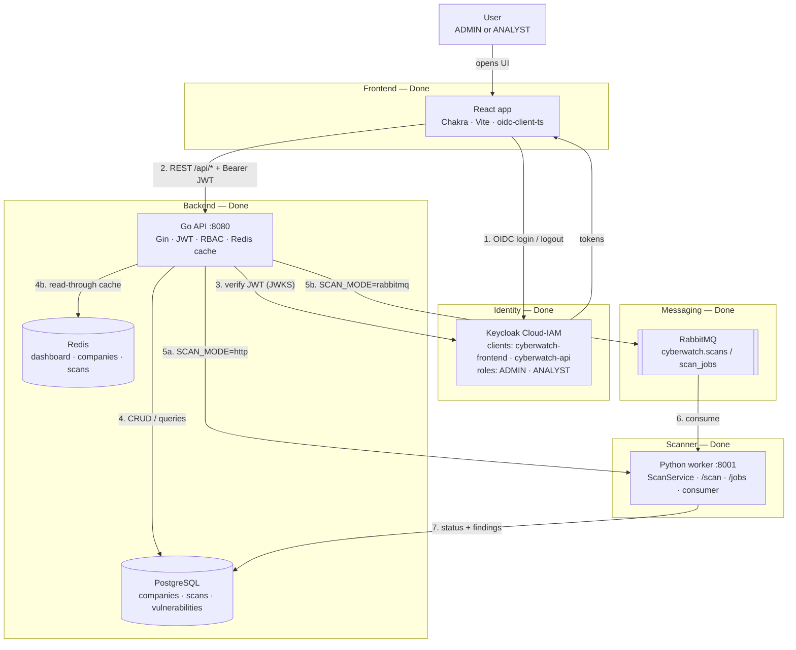
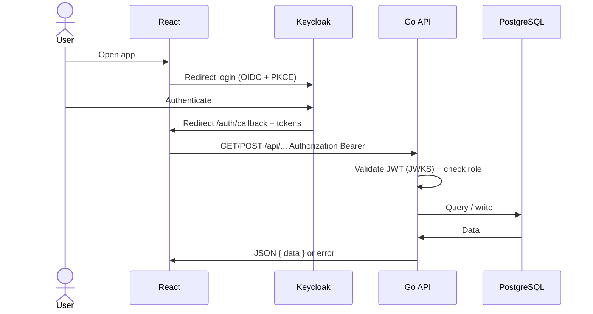
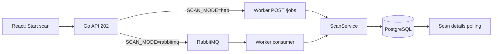
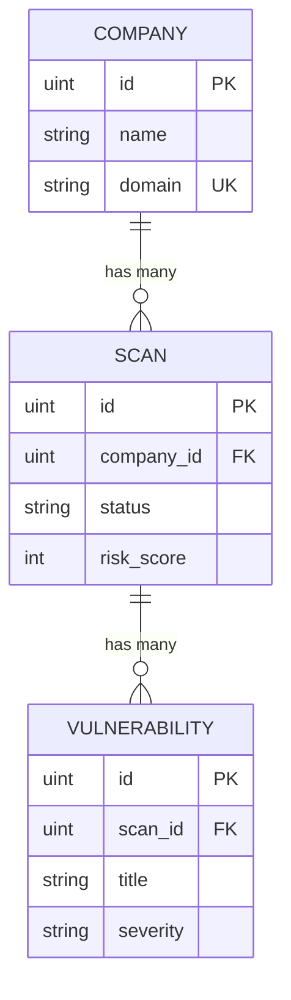

# CyberWatch

## External Attack Surface Monitoring Platform


# Project overview

CyberWatch is a simplified **External Attack Surface Monitoring** platform inspired by products such as [AlgoSecure AlgoLightHouse](https://www.algosecure.fr/conseil/algolighthouse/).

It provides a full-stack application to:

- manage monitored companies
- launch external security scans
- detect publicly exposed weaknesses
- calculate a risk score
- display results on a security dashboard

# Current status

| Area | Status |
|------|--------|
| React frontend (dashboard, companies, scans) | **Done** |
| Go REST API + PostgreSQL | **Done** |
| Keycloak IAM (hosted Cloud-IAM) | **Done** |
| Python scanner worker (FastAPI `/scan`) | **Done** |
| Async scans — HTTP `/jobs` + RabbitMQ | **Done** |
| Redis / Elasticsearch / Docker / CI | Redis **Done** · ES / Docker / CI Planned |

# Business context

Companies expose domains, websites, APIs, and public services on the Internet.

CyberWatch helps analysts answer:

> What is publicly exposed, and what is a potential security risk?

# Architecture

Solid lines = **working today**. Dashed lines = **planned**.



### How pieces relate (today)

| From | To | Relation |
|------|-----|----------|
| User | React | Uses dashboard / companies / scans |
| React | Keycloak | Login via OIDC + PKCE (`cyberwatch-frontend`) |
| React | Go API | Authenticated REST calls with access token |
| Go API | Keycloak | Validates JWT signature using realm JWKS |
| Go API | PostgreSQL | Source of truth for companies, scans, vulnerabilities |
| Go API | Redis | Read-through cache (optional; falls back to DB) |
| Go API | Worker / RabbitMQ | `SCAN_MODE=http` → `POST /jobs` · `rabbitmq` → `scan_jobs` |
| Worker | PostgreSQL | Updates scan status + vulnerabilities |
| Go API | User roles | `ADMIN` / `ANALYST` enforce write permissions |

### Auth flow



### Scan pipeline



Statuses: `PENDING` → `QUEUED` → `RUNNING` → `COMPLETED` / `FAILED`

# Technology stack

## Frontend (`frontend/`)

- React · TypeScript · Vite · Chakra UI
- React Router · TanStack Query · Axios · Recharts
- oidc-client-ts (no local login page)
- UI: AlgoSecure-inspired green / navy · light & dark mode
- Scan details auto-refresh while in progress

**Pages:** Dashboard · Companies · Scan details · `/auth/callback` · `/silent-renew`

## Backend (`backend-api/`)

- Go · Gin · GORM · PostgreSQL
- JWT via Keycloak JWKS
- RBAC middleware on `/api/*` (`GET /health` is public)
- `SCAN_MODE=http|rabbitmq` · `internal/messaging` publisher interface
- Redis read-through cache (`REDIS_URL`) · `internal/cache`

## Scanner worker (`worker/`)

- Python 3.12+ · FastAPI · Uvicorn · Pydantic · Pika
- Passive checks: DNS · HTTP · security headers · technologies · common ports · risk score
- `POST /scan` (sync debug) · `POST /jobs` (dev async) · `python -m app.consumer` (RabbitMQ)
- See [`worker/README.md`](worker/README.md)

## Authentication (Keycloak)

| Role | Can do |
|------|--------|
| `ADMIN` | Create / update / delete companies · view all · create scans |
| `ANALYST` | View dashboard / companies / scans · create scans |

Setup: [`docs/KEYCLOAK.md`](docs/KEYCLOAK.md)

## Planned

| Component | Role |
|-----------|------|
| Elasticsearch | Worker logs / events |
| Docker Compose | Local multi-service stack |

# Database



One **company** has many **scans**. One **scan** has many **vulnerabilities**.

**Scan status:** `PENDING` · `RUNNING` · `COMPLETED` · `FAILED`  
**Severity:** `LOW` · `MEDIUM` · `HIGH` · `CRITICAL`

# Project structure

```text
CyberWatch/
├── frontend/           # React UI + OIDC
├── backend-api/        # Go REST API + JWT/RBAC
├── worker/             # Python passive scanner (FastAPI)
├── docs/               # Keycloak setup
├── infrastructure/     # Planned — Docker
├── DEVELOPMENT_PLAN.md
└── README.md
```
# Getting started

**Need:** Node.js, Go, PostgreSQL, Cloud-IAM Keycloak ([guide](docs/KEYCLOAK.md)), optional Redis

```powershell
# Redis (optional)
docker run -d --name cyberwatch-redis -p 6379:6379 redis:7-alpine

# API
cd backend-api
copy .env.example .env   # DATABASE_* + KEYCLOAK_* + REDIS_URL
go mod tidy
go run ./cmd/server      # http://localhost:8080/health

# UI
cd frontend
copy .env.example .env   # VITE_API_URL + VITE_KEYCLOAK_*
npm install
npm run dev              # http://localhost:5173 → Keycloak
```

More detail: [`backend-api/README.md`](backend-api/README.md) · [`frontend/README.md`](frontend/README.md)

# Development order

| # | Phase | Status |
|---|-------|--------|
| 1 | React dashboard | **Done** |
| 2 | Go API + PostgreSQL | **Done** |
| 3 | Keycloak OIDC + JWT RBAC | **Done** |
| 4 | Python scanner worker | **Done** |
| 5 | RabbitMQ + dual scan transport | **Done** |
| 6 | Redis caching layer | **Done** |
| 7–9 | Elasticsearch · Docker · CI/CD | Planned |

Full checklist: [`DEVELOPMENT_PLAN.md`](DEVELOPMENT_PLAN.md)

# Security rules

- No secrets in source — use `.env`
- Validate API inputs
- Protect `/api/*` with JWT + roles
- Passwords live in Keycloak only

# Project objective

Show the ability to build a secure full-stack cybersecurity monitoring platform with a distributed architecture close to real products — inspired by AlgoSecure AlgoLightHouse.
