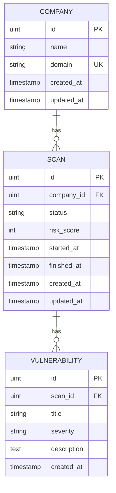

# CyberWatch Backend API

Go REST API for the CyberWatch External Attack Surface Monitoring Platform.

## Stack

- Go · Gin · GORM · PostgreSQL

## Structure

```
backend-api/
├── cmd/server/          # App entrypoint (starts the HTTP server)
├── internal/
│   ├── config/          # Loads env vars (.env)
│   ├── database/        # PostgreSQL connection + AutoMigrate
│   ├── models/          # GORM entities (Company, Scan, Vulnerability)
│   ├── repositories/    # Database queries / data access
│   ├── services/        # Business logic + validation
│   ├── handlers/        # HTTP request/response handlers
│   ├── routes/          # API route registration
│   ├── middleware/      # CORS, request logging
│   └── response/        # Shared JSON success/error helpers
└── migrations/          # SQL schema reference
```

## Database relations

```text
Company (1) ──────< (N) Scan (1) ──────< (N) Vulnerability
```

- One **Company** has many **Scans**
- One **Scan** has many **Vulnerabilities**



**Scan status:** `PENDING` · `RUNNING` · `COMPLETED` · `FAILED`  
**Severity:** `LOW` · `MEDIUM` · `HIGH` · `CRITICAL`

## Setup

### 1. PostgreSQL

Install PostgreSQL 17 and make sure the service `postgresql-x64-17` is running.

Create the database (SQL Shell / psql):

```sql
CREATE DATABASE cyberwatch;
```

### 2. Environment

```powershell
copy .env.example .env
```

Edit `.env` with your credentials:

```env
DATABASE_HOST=localhost
DATABASE_PORT=5432
DATABASE_USER=postgres
DATABASE_PASSWORD=your_password
DATABASE_NAME=cyberwatch
```

### 3. Run

```powershell
cd backend-api
go mod tidy
go run ./cmd/server
```

- Health: http://localhost:8080/health
- Dashboard: http://localhost:8080/api/dashboard

## Endpoints

| Method     | Path                 | Description                    |
| ---------- | -------------------- | ------------------------------ |
| GET        | `/health`            | Health check                   |
| GET        | `/api/dashboard`     | Dashboard stats                |
| GET / POST | `/api/companies`     | List / create companies        |
| GET        | `/api/companies/:id` | Company details                |
| PUT        | `/api/companies/:id` | Update company                 |
| DELETE     | `/api/companies/:id` | Delete company                 |
| GET / POST | `/api/scans`         | List / create scan (`PENDING`) |
| GET        | `/api/scans/:id`     | Scan + vulnerabilities         |

```json
POST /api/companies
{ "name": "Demo Corporation", "domain": "demo.com" }

PUT /api/companies/1
{ "name": "Demo Corporation", "domain": "demo.com" }

POST /api/scans
{ "companyId": 1 }
```

## Responses

```json
{ "data": {} }
{ "error": "message" }
```

## Tests

```bash
go test ./...
```

Uses in-memory SQLite (no PostgreSQL required).
