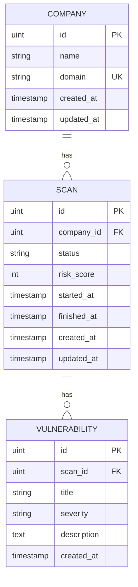

# CyberWatch Backend API

Go REST API for the CyberWatch External Attack Surface Monitoring Platform.

## Stack

- Go · Gin · GORM · PostgreSQL
- Keycloak (JWT via JWKS) for authentication & RBAC
- Redis (go-redis v9) read-through cache — optional

## Structure

```
backend-api/
├── cmd/server/          # App entrypoint
├── internal/
│   ├── auth/            # Role constants (ADMIN, ANALYST)
│   ├── cache/           # Redis / Noop Cache interface
│   ├── config/          # Loads env vars (.env)
│   ├── database/        # PostgreSQL connection + AutoMigrate
│   ├── models/          # GORM entities (Company, Scan, Vulnerability)
│   ├── repositories/    # Database access
│   ├── services/        # Business logic + validation (+ cache)
│   ├── handlers/        # HTTP handlers
│   ├── routes/          # Route registration + role guards
│   ├── middleware/      # CORS, logging, JWT auth, RBAC
│   ├── messaging/       # Scan job publishers (HTTP / RabbitMQ)
│   └── response/        # Shared JSON helpers
└── migrations/          # SQL schema reference
```

## Database relations

```text
Company (1) ──────< (N) Scan (1) ──────< (N) Vulnerability
```



**Scan status:** `PENDING` · `QUEUED` · `RUNNING` · `COMPLETED` · `FAILED`  
**Severity:** `LOW` · `MEDIUM` · `HIGH` · `CRITICAL`

## Setup

### 1. PostgreSQL

Create the database:

```sql
CREATE DATABASE cyberwatch;
```

### 2. Environment

```powershell
copy .env.example .env
```

Edit `.env`:

```env
APP_PORT=8080
APP_ENV=development
CORS_ORIGIN=http://localhost:5173

DATABASE_HOST=localhost
DATABASE_PORT=5432
DATABASE_USER=postgres
DATABASE_PASSWORD=your_password
DATABASE_NAME=cyberwatch
DATABASE_SSLMODE=disable

KEYCLOAK_URL=https://<host>.cloud-iam.com/auth
KEYCLOAK_REALM=<your-realm>
KEYCLOAK_CLIENT_ID=cyberwatch-api

SCAN_MODE=http
WORKER_URL=http://localhost:8001

# Optional — if unset or Redis is down, API uses PostgreSQL only
REDIS_URL=redis://localhost:6379
```

For deploy, set `CORS_ORIGIN`, `WORKER_URL` / `RABBITMQ_URL`, and Keycloak/DB to your real hosts — nothing sensitive is hardcoded in the Go binary.

Keycloak vars are **required** — the server will not start without them.  
`CORS_ORIGIN` and (when `SCAN_MODE=http`) `WORKER_URL` are also required.  
`REDIS_URL` is optional.  
Full IdP setup: [`docs/KEYCLOAK.md`](../docs/KEYCLOAK.md).

### Redis caching

Read-through cache in `internal/cache/`. Keys / TTLs:

| Key | TTL |
|-----|-----|
| `dashboard:stats` | 60s |
| `companies:list` / `company:{id}` | 5m |
| `scan:{id}` | 30s |
| `scan:status:{id}` | 10s |

Invalidated on company mutations and scan create / terminal status observations. Never fails a request if Redis is offline.

```powershell
docker run -d --name cyberwatch-redis -p 6379:6379 redis:7-alpine
```

### 3. Run

```powershell
cd backend-api
go mod tidy
go run ./cmd/server
```

- Health (public): http://localhost:8080/health  
- API (JWT required): http://localhost:8080/api/...

## Authentication

All `/api/*` routes require a valid Keycloak access token:

```http
Authorization: Bearer <access_token>
```

| Action | Roles |
|--------|-------|
| View dashboard / companies / scans | `ADMIN` or `ANALYST` |
| Create / update / delete company | `ADMIN` |
| Create scan | `ADMIN` or `ANALYST` |

| Status | Meaning |
|--------|---------|
| `401` | Missing / invalid token |
| `403` | Valid token, insufficient role |

Public: `GET /health`

## Endpoints

| Method | Path | Auth | Description |
|--------|------|------|-------------|
| GET | `/health` | Public | Health check |
| GET | `/api/dashboard` | ADMIN, ANALYST | Dashboard stats |
| GET / POST | `/api/companies` | GET: any · POST: ADMIN | List / create |
| GET / PUT / DELETE | `/api/companies/:id` | GET: any · write: ADMIN | Company CRUD |
| GET / POST | `/api/scans` | GET: any · POST: ADMIN, ANALYST | List / create scan (**202**, async) |
| GET | `/api/scans/:id` | ADMIN, ANALYST | Scan + vulnerabilities |

```json
POST /api/companies
{ "name": "Demo Corporation", "domain": "demo.com" }

PUT /api/companies/1
{ "name": "Demo Corporation", "domain": "demo.com" }

POST /api/scans
{ "companyId": 1 }
```

## Responses

```json
{ "data": {} }
{ "error": "message" }
```

## Tests

```bash
go test ./...
```

Uses in-memory SQLite (no PostgreSQL or Keycloak required).
