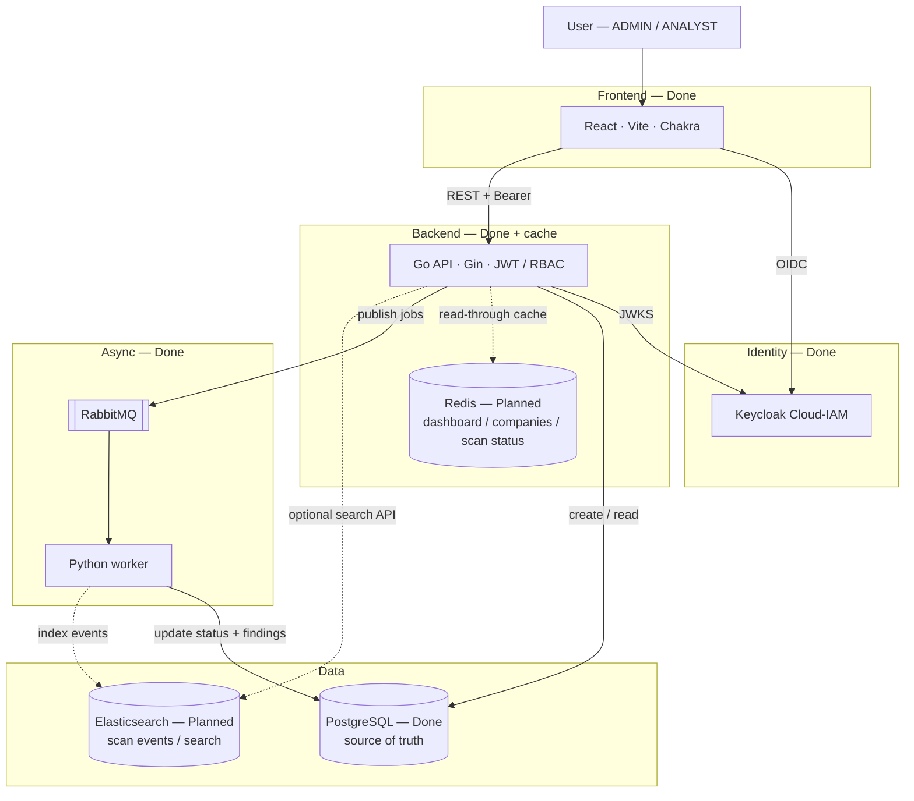
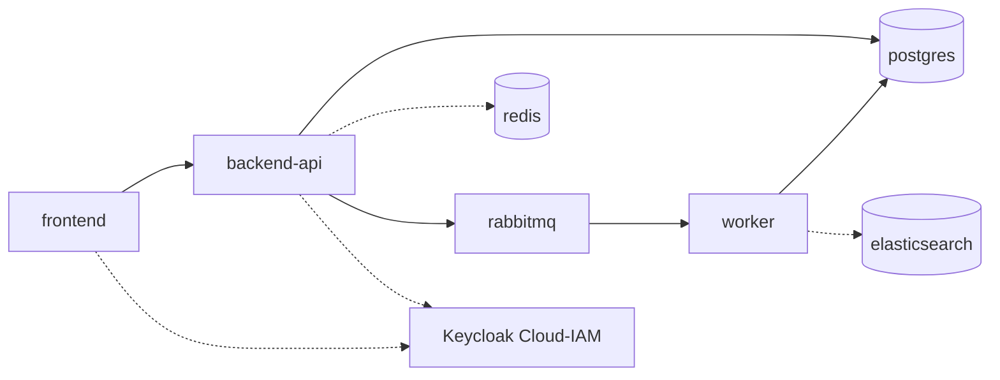

# Planned architecture

> **Not implemented.** This document describes the **future** CyberWatch target once Redis, Elasticsearch, and CI/CD are added.  
> For what runs **today**, see the root [`README.md`](../README.md).

---

## Why later

| Component | Intended role | Status |
|-----------|---------------|--------|
| **Redis** | Cache dashboard aggregates, company lists, and hot scan status | Planned |
| **Elasticsearch** | Index scan events / findings for search and ops visibility | Planned |
| **GitHub Actions** | Build, test, and image CI/CD | Planned |

Current production-like stack already covers: React · Go API · PostgreSQL · RabbitMQ · Python worker · Docker Compose · external Keycloak.

---

## Target architecture (future)

Solid boxes = already built. Dashed / highlighted = **to add**.



### Future Docker Compose (sketch)



Services that would be **added** later (not present now):

| Service | Image (typical) | Purpose |
|---------|-----------------|--------|
| `redis` | `redis:7-alpine` | Cache layer in front of hot API reads |
| `elasticsearch` | `elasticsearch:8.x` | Worker/event indexing and search |

Keycloak remains **external** (Cloud-IAM) — still not containerized locally.

---

## Redis (planned)

**Goal:** reduce load on PostgreSQL for repeated dashboard and list reads.

Typical design (when implemented):

```text
GET /api/dashboard
  → cache hit? return Redis
  → miss? query PostgreSQL → set Redis TTL → return
```

Candidates to cache:

- Dashboard summary
- Company list / detail (short TTL)
- In-progress scan status (invalidate on COMPLETED / FAILED)

Invalidation: on company write and when a scan finishes.

---

## Elasticsearch (planned)

**Goal:** searchable scan history and operational visibility beyond relational queries.

Typical design (when implemented):

```text
Worker completes scan
  → write vulnerabilities + score to PostgreSQL (source of truth)
  → index event document to Elasticsearch
```

Possible document fields: `scan_id`, `company_id`, `domain`, `status`, `risk_score`, `findings[]`, `timestamp`.

API could later expose search endpoints backed by ES while PostgreSQL stays authoritative for CRUD.

---

## CI/CD (planned)

GitHub Actions ideas (not wired yet):

- Lint / test frontend, Go API, worker on PR
- Build Docker images
- Optional push to a registry on `main`

---

## Migration path (when we start)

1. Add Redis service + client in Go API (cache reads only; no change to scan correctness)
2. Add Elasticsearch + worker indexer (PostgreSQL remains source of truth)
3. Extend `infrastructure/docker-compose.yml` and `infrastructure/.env.example`
4. Add GitHub Actions workflows under `.github/workflows/`

Until then, run the **current** stack only:

```powershell
make start
```

See root [`README.md`](../README.md).
